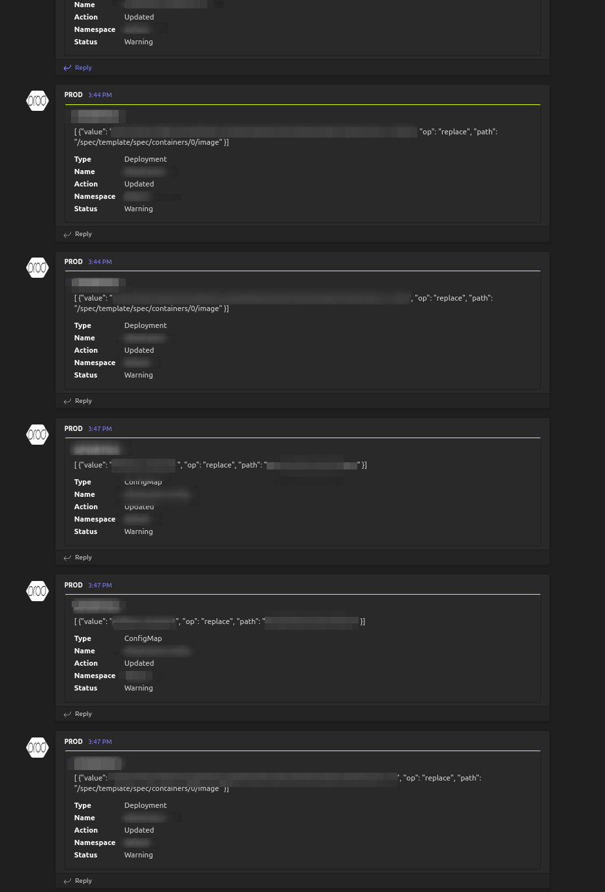

# kubestatewatch is a State Monitor for k8s 

**kubestatewatch** functions as a surveillance system for Kubernetes. Tracking different resources for any changes and letting users know exactly what has been changed.

It can be used standalone or deployed in Kubernetes. But its main purpose is to be deployed in Kubernetes.

KubeStateWatch is an extended and simplified version of [kubewatch](https://github.com/robusta-dev/kubewatch) to meet the needs of our team

#### Whats the difference between kubewatch and kubestatewatch?
It has been extended to support more the one connector, better support on multiple namespaces, visiblity to what was changed,simplified configuration, extended resource specific configura, added metrics and few other small stuff.

## UseCase
<i>Imagine you're managing a large Kubernetes cluster that has many different areas (namespaces) used by various people or teams. You need a way to keep an eye on any changes that happen in these areas that were made without the use  of CI/CD pipelines ( for example using kubectl, lens, k9s etc.). In such cases you want to get notified about such changes,you also want to see what exactly was changed. This is what **kubestatewatch** is for.</i>

<div align="center">


[](https://travis-ci.org/marvasgit/kubestatewatch) 
[](https://goreportcard.com/report/github.com/marvasgit/kubestatewatch) 
[](https://codecov.io/gh/marvasgit/kubestatewatch)
[](https://hub.docker.com/repository/docker/docmarr/kubestatewatch) 

</div>

There are basically two kind of notifications:
- **Notifications for Updated Items**: The core purpose here is to focus on tracking meaningful changes to the items under our watch, while disregarding minor alterations like metadata or status updates. Rather than just receiving a basic message that something has changed, we aim to gain precise insight into what specifically was altered and the timing of these changes.
- **Notifications for Added/Deleted Items**: The foundational concept of kubewatch was to monitor and report on items that are newly added or removed.

Although this aspect is important, our primary focus is on the first scenario: tracking modifications to the items we are monitoring, such as deployments, replica sets (rs), horizontal pod autoscalers (hpa), and configmaps. We aim to be promptly informed about any and all changes occurring within these elements.

## Version 2.0.0 Changes
- Added support for configuration per resource (**breaking change in the configuration file**)
> This gives you the ability to configure each resource separately. For example, you can configure monitoring only the UPDATES on deployments, while monitoring ADD and DELETE on replica sets and DELETE on pods and etc.Also, now you can ignore specific paths in the diff per resource. Which gives you more control over what you want to monitor.
``` yaml
#OLD
resourcesToWatch:
  configmap: true
#NEW
  configmap:
    enabled: true
    includeEvenTypes:
    #- "add"
    #- "update"
    #- "delete"
    ignorePath:
    # - "/status"
```
- Added support for muting notifications during deployment.
> This feature allows you to mute notifications during deployment. This is useful when you have a deployment ongoing and you don't want to be notified about every change that happens during the deployment. You can mute notifications for a specific time period. This keeps the notifications clean and relevant. Also this keeps your webhook from being overloaded.Some webhooks have a rate [limit](https://docs.microsoft.com/en-us/microsoftteams/platform/webhooks-and-connectors/how-to/add-incoming-webhook#rate-limits) per minute, so this feature can help you avoid hitting the rate limit and missing important notifications after the deployment.

It accepts two parameters:
- namespace: the namespace you want to mute notifications for
- duration: the duration you want to mute notifications for in minutes
The path looks like this:
PUT url/deploy/**namespace**/**duration**
PUT url/deploy/**namespace** - uses default duration of 2 minutes
POST url/reset - clears all muted namespaces
```sh
#Examples:
curl -X PUT http://localhost:8080/deploy/default/5
#Mutes notifications for the default namespace for 5 minutes
curl -x Delete http://localhost:8080/deploy/default
#Clears the default namespace from the muted list
curl -X PUT http://localhost:8080/deploy/default
#Mutes notifications for the default namespace for 2 minutes
curl -X POST http://localhost:8080/reset
#Clears all muted namespaces
```

### How it looks like

<div align="center">

</div>

# Latest image

```
docmarr/kubestatewatch:2.0.0
```

## Installing the Chart

To install the chart with the release name `my-release`:

```console
$ helm repo add kubestatewatch https://marvasgit.github.io/kubestatewatch/
$ helm install my-release kubestatewatch -n NS
```

The command deploys statemonitor on the Kubernetes cluster in the default configuration. With the default configuration, the chart monitors all namespaces. 

```console
$ helm install my-release -f values.yaml statemonitor
```

> **Tip**: You can use the default [values.yaml](/charts/kubestatewatch/values.yaml)

## Uninstalling the Chart

To uninstall/delete the `my-release` deployment:

```console
$ helm delete my-release
```
The command removes all the Kubernetes components associated with the chart and deletes the release.

## Configuration and installation details

### Create a Slack bot

Open [https://my.slack.com/services/new/bot](https://my.slack.com/services/new/bot) to create a new Slack bot.
The API token can be found on the edit page (it starts with `xoxb-`).

Invite the Bot to your channel by typing `/join @name_of_your_bot` in the Slack message area.
### Create a Microsoft Teams webhook

Once you have a Teams account and have created a team to work with, take the following steps to create a webhook:
- Channel -> Connectors -> Incoming Webhook -> Configure -> Add -> Name -> Create
- Copy the webhook URL and paste it into the `msteams.webhook` value in the `values.yaml` file.
- Change the `msteams.enabled` value to `true` in the `values.yaml` file.

> **IMPORTANT Note**: There is a msg rate limit per webhook per minute. If you exceed the limit, you will receive a 429 error code. Here is a link for more information on [rate limits](https://docs.microsoft.com/en-us/microsoftteams/platform/webhooks-and-connectors/how-to/add-incoming-webhook#rate-limits).

### Configure important chart values in `values.yaml`

Based on the desired communication channel, you need to configure the following values in the `values.yaml` file:
- Channel .enabled  - where the channel is your desired communication channel (slack, msteams, discord, etc.)
- Relevant values for the channel (slack.token, msteams.webhook, etc.)
- `namespaceconfig.include & namespaceconfig.exclude` - the namespaces you want to monitor, By default you monitor everything. If you want to monitor only specific namespaces, you can use the include and exclude options. If you use both, the exclude option will be ignored. You probably want to exclude the kube-system namespace.
- `resources` - the resources you want to monitor
- `ignore` - the resources you want to ignore
- `diff.ignorePath` -  this configuration affects all components that you watch. the paths you want to ignore in the diff ( Usually /metadata, /status, and everything that is not relevant to you)

``` yaml
message:
  title: "XXXX"
diff:
  ignorePath:
  #- "/metadata"
  #- "/spec/template/metadata"
  #- "/status"
  #- "/spec/replicas"
  #- "/lastTimestamp"
  #- "/data/status"
  #- "/count"

  # - "/metadata"
  # - "/status"
  # - "/metadata/replicas"
namespacesconfig:
  include:
  exclude:
  #- "kube-system"
  #- "cattle-fleet-system"
# changed on V2.0.0
resourcesToWatch:
  configmap:
    enabled: true
    includeEvenTypes:
    #- "add"
    #- "update"
    #- "delete"
    ignorePath:
    # - "/status"

  daemonset:
    enabled: true
    includeEvenTypes:
    #- "add"
    #- "update"
    #- "delete"
    ignorePath:
    # - "/status"

  deployment:
    enabled: true
    includeEvenTypes:
    #- "add"
    #- "update"
    #- "delete"
    ignorePath:
    # - "/status"

  event:
    enabled: false
    includeEvenTypes:
    #- "add"
    #- "update"
    #- "delete"
    ignorePath:
    # - "/status"

  coreevent:
    enabled: false
    includeEvenTypes:
    #- "add"
    #- "update"
    #- "delete"
    ignorePath:
    # - "/status"

  hpa:
    enabled: false
    includeEvenTypes:
    #- "add"
    #- "update"
    #- "delete"
    ignorePath:
    # - "/status"

  job:
    enabled: false
    includeEvenTypes:
    #- "add"
    #- "update"
    #- "delete"
    ignorePath:
    # - "/status"

  persistentvolume:
    enabled: false
    includeEvenTypes:
    #- "add"
    #- "update"
    #- "delete"
    ignorePath:
    # - "/status"

  pod:
    enabled: false
    includeEvenTypes:
    #- "add"
    #- "update"
    #- "delete"
    ignorePath:
    # - "/status"

  replicaset:
    enabled: false
    includeEvenTypes:
    #- "add"
    #- "update"
    #- "delete"
    ignorePath:
    # - "/status"

  replicationcontroller:
    enabled: false
    includeEvenTypes:
    #- "add"
    #- "update"
    #- "delete"
    ignorePath:
    # - "/status"

  node:
    enabled: false
    includeEvenTypes:
    #- "add"
    #- "update"
    #- "delete"
    ignorePath:
    # - "/status"

  services:
    enabled: false
    includeEvenTypes:
    #- "add"
    #- "update"
    #- "delete"
    ignorePath:
    # - "/status"

  ```
> #### Configure connectors 

You can configure multiple connectors, for example slack and msteams, or slack and smtp, or slack and webhook, etc.

``` yaml
slack:
  enabled: false
  channel: "XXXX"
  token: "XXXX"
slackwebhook:
  enabled: false
  channel: "XXXX"
  username: ""
  emoji: ""
  slackwebhookurl: "XXXX"
hipchat:
  enabled: false
  room: ""
  token: ""
  url: ""
mattermost:
  enabled: false
  channel: ""
  url: ""
  username: ""
flock:
  enabled: false
  url: ""
msteams:
  enabled: false
  webhookurl: "XXXX"
webhook:
  enabled: false
  url: ""
cloudevent:
  enabled: false
  url: ""
lark:
  enabled: false
  webhookurl: ""
smtp:
  enabled: false
  to: ""
  from: ""
  hello: ""
  smarthost: ""
  subject: ""
  auth:
    username: ""
    password: ""
    secret: ""
    identity: ""
  requireTLS: ""
telegram:
  enabled: false
  token: ""
  chatID: 0
  messageThreadID: 0
```
#### Using Docker:

To Run statemonitor Container interactively, place the config file in `/path/to/your/appsettings.json` location and use the following command.

```
docker run --rm -it --network host -v /path/to/your/appsettings.json:/config/appsettings.json --name <container-name> docmarr/kubestatewatch:1.0.2
```
### Using local docker container

If you want to build the docker image locally, you can use the following commands:
> clone repo 
```sh
git clone github.com/marvasgit/kubestatewatch.git
```
> build docker image and run it 
```sh
docker build -t <docker.tagname> .

docker run --rm -it --network host -v /path/to/your/appsettings.json:/config/appsettings.json --name <container-name> <docker.tagname>
```


# Build

### Using go

Clone the repository anywhere:
```console
$ git clone https://github.com/marvasgit/kubestatewatch.git
$ cd statemonitor
$ go build
```
or

You can also use the Makefile directly:

```console
$ make build
```

#### Prerequisites

- You need to have [Go](http://golang.org) (v1.5 or later)  installed. Make sure to set `$GOPATH`


### Using Docker

```console
$ make docker-image
$ docker images
REPOSITORY          TAG                 IMAGE ID            CREATED              SIZE
statemonitor           latest              919896d3cd90        3 minutes ago       13.9MB
```
#### Prerequisites

- you need to have [docker](https://docs.docker.com/) installed.

# Things for future version
None at the moment. But if you have any suggestions, please create an issue.

# Contribution

Refer to the [contribution guidelines](docs/CONTRIBUTION.md) to get started.
